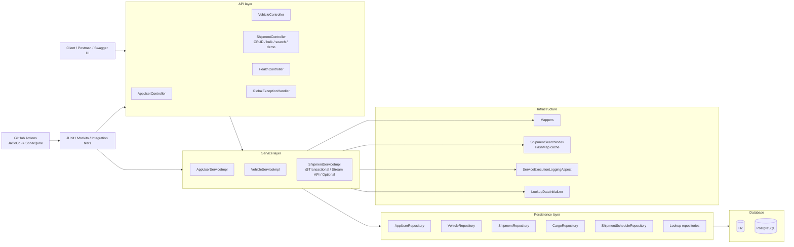

# Logistics Application

REST API для управления логистическими заказами на `Spring Boot`.

Проект покрывает:

- CRUD для пользователей, транспорта и заказов;
- bulk-операцию массового создания `Shipment`;
- сложные связи JPA;
- демонстрацию `N+1` и оптимизацию через `@EntityGraph`;
- транзакционное поведение (`partial-save` vs `rollback`) для single и bulk сценариев;
- расширенный поиск `Shipment` через `JPQL` и `native query`;
- пагинацию (`Pageable`);
- in-memory индекс (`HashMap`) для кэширования результатов поиска;
- использование `Stream API` и `Optional` в сервисном слое;
- unit- и integration-тесты;
- CI-анализ с `JaCoCo` и `SonarQube`.

## Стек

- `Java 21`
- `Spring Boot 4.0.3`
- `Spring Web MVC`
- `Spring Data JPA`
- `H2`
- `PostgreSQL`
- `Maven`
- `Checkstyle`
- `Mockito`
- `JaCoCo`
- `GitHub Actions`
- `SonarQube`

## Модель данных

### Основные сущности

- `AppUser`
- `Vehicle`
- `Shipment`
- `Cargo`
- `ShipmentSchedule`

### Справочники (lookup tables)

- `UserRoleLookup` (`user_roles`)
- `ShipmentStatusLookup` (`shipment_statuses`)

Важно: в БД в `app_users` и `shipments` хранятся `role_id` и `status_id`, а не строковые enum-значения.

## Связи

- `Shipment -> Cargo`: `OneToMany`
- `Shipment -> ShipmentSchedule`: `OneToOne`
- `Shipment <-> Vehicle`: `ManyToMany`
- `Shipment -> AppUser (customer/manager)`: `ManyToOne`
- `Vehicle -> AppUser (assignedCarrier)`: `ManyToOne`
- `AppUser -> UserRoleLookup`: `ManyToOne`
- `Shipment -> ShipmentStatusLookup`: `ManyToOne`

## Структурная схема



Коротко по слоям:

- `controller` принимает HTTP-запросы, валидирует входные DTO и делегирует работу сервисам;
- `service` содержит бизнес-логику: CRUD, bulk-операции, транзакции, поиск, кэш и проверки;
- `repository` работает с JPA и БД;
- `mapper` преобразует entity в response DTO;
- `cache` хранит результаты поиска `Shipment`;
- `aspect` логирует время выполнения сервисных методов;
- `test` проверяет приложение на уровне unit и integration;
- `.github/workflows` запускает сборку, тесты и отправку coverage в SonarQube.

## Структура проекта

```text
logisticsapplication/
├── .github/
│   └── workflows/
│       └── ci-sonarqube.yml
├── pom.xml
├── README.md
├── Task.md
├── config/
│   ├── checkstyle.xml
│   └── checkstyle-suppressions.xml
├── postman/
│   └── LogisticsApplication.postman_collection.json
└── src/
    ├── main/
    │   ├── java/
    │   │   └── com/
    │   │       └── logisticsapplication/
    │   │           ├── LogisticsApplication.java
    │   │           ├── aspect/
    │   │           │   └── ServiceExecutionLoggingAspect.java
    │   │           ├── cache/
    │   │           │   ├── ShipmentSearchCacheKey.java
    │   │           │   └── ShipmentSearchIndex.java
    │   │           ├── controller/
    │   │           │   ├── AppUserController.java
    │   │           │   ├── HealthController.java
    │   │           │   ├── ShipmentController.java
    │   │           │   └── VehicleController.java
    │   │           ├── config/
    │   │           │   ├── LookupDataInitializer.java
    │   │           │   └── OpenApiConfig.java
    │   │           ├── service/
    │   │           │   ├── AppUserService.java
    │   │           │   ├── ShipmentService.java
    │   │           │   ├── VehicleService.java
    │   │           │   └── impl/
    │   │           │       ├── AppUserServiceImpl.java
    │   │           │       ├── ShipmentServiceImpl.java
    │   │           │       └── VehicleServiceImpl.java
    │   │           ├── repository/
    │   │           │   ├── AppUserRepository.java
    │   │           │   ├── CargoRepository.java
    │   │           │   ├── ShipmentRepository.java
    │   │           │   ├── ShipmentScheduleRepository.java
    │   │           │   ├── ShipmentStatusLookupRepository.java
    │   │           │   ├── UserRoleLookupRepository.java
    │   │           │   └── VehicleRepository.java
    │   │           ├── model/
    │   │           │   ├── AppUser.java
    │   │           │   ├── Cargo.java
    │   │           │   ├── Shipment.java
    │   │           │   ├── ShipmentSchedule.java
    │   │           │   ├── ShipmentSearchQueryType.java
    │   │           │   ├── ShipmentStatus.java
    │   │           │   ├── ShipmentStatusLookup.java
    │   │           │   ├── UserRole.java
    │   │           │   ├── UserRoleLookup.java
    │   │           │   └── Vehicle.java
    │   │           ├── dto/
    │   │           │   ├── request/
    │   │           │   │   ├── AppUserRequest.java
    │   │           │   │   ├── CargoRequest.java
    │   │           │   │   ├── ShipmentRequest.java
    │   │           │   │   ├── ShipmentScheduleRequest.java
    │   │           │   │   └── VehicleRequest.java
    │   │           │   └── response/
    │   │           │       ├── AppUserResponse.java
    │   │           │       ├── CargoResponse.java
    │   │           │       ├── PageResponse.java
    │   │           │       ├── ShipmentResponse.java
    │   │           │       ├── ShipmentScheduleResponse.java
    │   │           │       ├── VehicleResponse.java
    │   │           │       └── ApiErrorResponse.java
    │   │           ├── exception/
    │   │           │   └── GlobalExceptionHandler.java
    │   │           └── mapper/
    │   │               ├── AppUserMapper.java
    │   │               ├── ShipmentMapper.java
    │   │               └── VehicleMapper.java
    │   └── resources/
    │       ├── application.properties
    │       ├── application-postgres.properties
    │       ├── logback-spring.xml
    │       └── sql/
    │           ├── fix_app_users_table_postgres.sql
    │           └── migrate_roles_and_statuses_to_lookup_tables.sql
    └── test/
        ├── java/
        │   └── com/
        │       └── logisticsapplication/
        │           ├── ApiEndpointsIntegrationTest.java
        │           ├── LogisticsapplicationApplicationTests.java
        │           ├── ShipmentTransactionIntegrationTest.java
        │           └── service/
        │               └── impl/
        │                   ├── AppUserServiceImplTest.java
        │                   ├── ShipmentServiceImplTest.java
        │                   └── VehicleServiceImplTest.java
        └── resources/
            └── application-test.properties
```

## API

### Базовые endpoints

- `GET/POST/PUT/DELETE /api/users`
- `GET/POST/PUT/DELETE /api/vehicles`
- `GET/POST/PUT/DELETE /api/shipments`
- `POST /api/shipments/bulk`
- `GET /api/health`

### N+1 демонстрация

- `GET /api/shipments?optimized=false`
- `GET /api/shipments?optimized=true`


### Транзакционная демонстрация

- `POST /api/shipments/demo/partial-save` (намеренный fail без общего rollback)
- `POST /api/shipments/demo/rollback` (намеренный fail c rollback)
- `POST /api/shipments/bulk/demo/partial-save` (bulk без общего rollback)
- `POST /api/shipments/bulk/demo/rollback` (bulk c rollback)

### Расширенный поиск Shipment

`GET /api/shipments/search`

Параметры:

- `customerEmail` (optional)
- `cargoName` (optional)
- `arrivalFrom` (optional, ISO datetime)
- `arrivalTo` (optional, ISO datetime)
- `queryType=JPQL|NATIVE`
- `page`, `size`, `sort` (`Pageable`)

Пример:

```http
GET /api/shipments/search?customerEmail=customer@test.local&cargoName=Paper&queryType=JPQL&page=0&size=5
```

Ответ содержит:

- контент страницы;
- `totalElements`, `totalPages`, `page`, `size`;
- `queryType`;
- `fromCache` (результат из in-memory индекса или нет).

## In-memory индекс поиска

Поиск кэшируется в `HashMap<ShipmentSearchCacheKey, PageResponse<ShipmentResponse>>`.

- ключ составной (`email`, `cargo`, диапазон дат, тип запроса, страница, размер, сортировка);
- корректность обеспечивается `equals()`/`hashCode()` в `ShipmentSearchCacheKey`;
- при изменении данных (`create/update/delete`) индекс инвалидируется.

## База данных и профили

### По умолчанию (H2)

- профиль: `h2`
- URL: `jdbc:h2:mem:logistics_db`
- console: `http://localhost:8080/h2-console`

### PostgreSQL

Файл профиля: `src/main/resources/application-postgres.properties`

Используются переменные окружения:

- `POSTGRES_URL` (optional, default `jdbc:postgresql://localhost:5432/logistics_db`)
- `POSTGRES_USER` (optional, default `logistics_user`)
- `POSTGRES_PASSWORD` (required)

Пример:

```bash
export POSTGRES_URL='jdbc:postgresql://localhost:5432/logistics_db'
export POSTGRES_USER='logistics_user'
export POSTGRES_PASSWORD='your_password'
```

## Миграция role/status в lookup-таблицы

SQL-файл:

- `src/main/resources/sql/migrate_roles_and_statuses_to_lookup_tables.sql`

Запуск:

```bash
psql -h localhost -U logistics_user -d logistics_db -f "src/main/resources/sql/migrate_roles_and_statuses_to_lookup_tables.sql"
```

## Postman

Готовая коллекция:

- `postman/LogisticsApplication.postman_collection.json`

Что она проверяет:

- полный CRUD flow;
- `search` через `JPQL` и `NATIVE`;
- пагинацию;
- кэш (`fromCache`);
- demo endpoint-ы транзакций;
- cleanup данных.

## CI и Coverage

- workflow: `.github/workflows/ci-sonarqube.yml`;
- сборка выполняет `./mvnw -B clean verify`;
- `JaCoCo` генерирует `target/site/jacoco/jacoco.xml`;
- self-hosted runner может отправлять анализ в локальный `SonarQube` на `http://localhost:9000`.

## Запуск и проверка

Установка/сборка:

```bash
./mvnw clean verify
```

Запуск приложения (H2):

```bash
./mvnw spring-boot:run
```

Запуск приложения (PostgreSQL):

```bash
./mvnw spring-boot:run -Dspring-boot.run.profiles=postgres
```

Тесты:

```bash
./mvnw test
```
