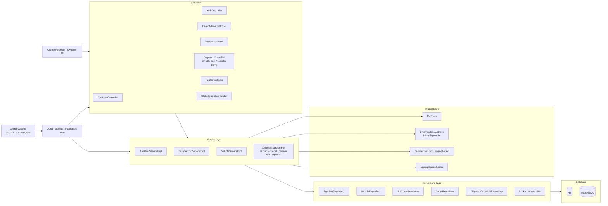

# Logistics Application

REST API для управления логистическими заказами на `Spring Boot`.

## Deployment и CI/CD

В проект добавлены:

- `Dockerfile` для backend-приложения;
- отдельный frontend-контейнер на `nginx`;
- `docker-compose.yml` для локального запуска `frontend + backend + PostgreSQL`;
- `.env.example` с набором переменных окружения;
- `render.yaml` для деплоя на `Render`;
- `.github/workflows/ci-cd.yml` для `build -> test -> deploy -> healthcheck`.

### Локальный запуск через Docker Compose

1. Создайте `.env` на основе `.env.example`.
2. Запустите:

```bash
docker compose up --build
```

3. Frontend будет доступен на `http://localhost`.
4. Frontend проксирует `/api/**` и `/actuator/**` в backend-контейнер.
4. Healthcheck:

```bash
curl http://localhost/actuator/health
```

### Render

Для бесплатного деплоя на `Render` можно использовать `Blueprint` из `render.yaml`.

Backend в проекте поддерживает оба формата Render-URL для Postgres:

- `jdbc:postgresql://...`
- `postgresql://...`

Если Render передаст `connectionString` без префикса `jdbc:`, приложение автоматически преобразует его в JDBC-формат при старте.

Нужно:

1. Подключить GitHub-репозиторий в Render.
2. Выбрать `Blueprint` deploy.
3. Подтвердить создание `Web Service` и `PostgreSQL`.
4. После первого деплоя взять:
   `Deploy Hook URL` из Render.
5. В GitHub добавить secrets:
   `RENDER_DEPLOY_HOOK_URL`
   `RENDER_HEALTHCHECK_URL`

Пример `RENDER_HEALTHCHECK_URL`:

```text
https://your-render-service.onrender.com/actuator/health
```

Проект покрывает:

- CRUD для пользователей, транспорта и заказов;
- авторизацию (`/api/auth/login`) и публичную регистрацию (`/api/auth/register`);
- веб-интерфейс с ролями `Admin`, `Manager`, `Customer`, `Carrier`;
- bulk-операцию массового создания `Shipment`;
- асинхронную bulk-операцию через `@Async` и `CompletableFuture` с `taskId` и проверкой статуса;
- потокобезопасные счётчики на `AtomicInteger` и `synchronized`;
- демонстрацию `race condition` через `ExecutorService` c `50+` потоками и безопасные варианты решения;
- сложные связи JPA;
- демонстрацию `N+1` и оптимизацию через `@EntityGraph`;
- транзакционное поведение (`partial-save` vs `rollback`) для single и bulk сценариев;
- расширенный поиск `Shipment` через `JPQL` и `native query`;
- пагинацию (`Pageable`);
- in-memory индекс (`HashMap`) для кэширования результатов поиска;
- использование `Stream API` и `Optional` в сервисном слое;
- unit- и integration-тесты;
- CI-анализ с `JaCoCo` и `SonarQube`.

## Стек

- `Java 21`
- `Spring Boot 4.0.3`
- `Spring Web MVC`
- `Spring Data JPA`
- `H2`
- `PostgreSQL`
- `Maven`
- `Checkstyle`
- `Mockito`
- `JaCoCo`
- `GitHub Actions`
- `SonarQube`

## Модель данных

### Основные сущности

- `AppUser`
- `Vehicle`
- `Shipment`
- `Cargo`
- `ShipmentSchedule`

### Справочники (lookup tables)

- `UserRoleLookup` (`user_roles`)
- `ShipmentStatusLookup` (`shipment_statuses`)

Важно: в БД в `app_users` и `shipments` хранятся `role_id` и `status_id`, а не строковые enum-значения.

## Связи

- `Shipment -> Cargo`: `OneToMany`
- `Shipment -> ShipmentSchedule`: `OneToOne`
- `Shipment <-> Vehicle`: `ManyToMany`
- `Shipment -> AppUser (customer/manager)`: `ManyToOne`
- `Vehicle -> AppUser (assignedCarrier)`: `ManyToOne`
- `AppUser -> UserRoleLookup`: `ManyToOne`
- `Shipment -> ShipmentStatusLookup`: `ManyToOne`

## Структурная схема



Коротко по слоям:

- `controller` принимает HTTP-запросы, валидирует DTO и делегирует работу сервисам;
- `service` содержит бизнес-логику: CRUD, авторизацию, bulk-операции, асинхронные задачи, транзакции, поиск, кэш и проверки;
- `repository` работает с JPA и БД;
- `mapper` преобразует entity в response DTO;
- `cache` хранит результаты поиска `Shipment`;
- `aspect` логирует время выполнения сервисных методов;
- `static` содержит публичную страницу компании и кабинеты ролей;
- `test` проверяет приложение на уровне unit и integration;
- `.github/workflows` запускает сборку, тесты и отправку coverage в SonarQube.

## Структура проекта

```text
logisticsapplication/
├── .github/
│   └── workflows/
│       └── ci-sonarqube.yml
├── jmeter/
│   ├── all-endpoints-no-delete.jmx
│   ├── race-condition-demo.jmx
│   └── results/
│       ├── jmeter-cli-error.txt
│       └── manual-probe.json
├── pom.xml
├── README.md
├── config/
│   ├── checkstyle.xml
│   └── checkstyle-suppressions.xml
├── postman/
│   ├── LogisticsApplication.postman_collection.json
│   ├── ShipmentBulk.postman_collection.json
│   └── ConcurrencyAsyncDemo.postman_collection.json
└── src/
    ├── main/
    │   ├── java/
    │   │   └── com/
    │   │       └── logisticsapplication/
    │   │           ├── LogisticsApplication.java
    │   │           ├── aspect/
    │   │           │   └── ServiceExecutionLoggingAspect.java
    │   │           ├── cache/
    │   │           │   ├── ShipmentSearchCacheKey.java
    │   │           │   └── ShipmentSearchIndex.java
    │   │           ├── config/
    │   │           │   ├── AsyncConfig.java
    │   │           │   ├── LookupDataInitializer.java
    │   │           │   └── OpenApiConfig.java
    │   │           ├── controller/
    │   │           │   ├── AppUserController.java
    │   │           │   ├── AuthController.java
    │   │           │   ├── ConcurrencyController.java
    │   │           │   ├── CargoAdminController.java
    │   │           │   ├── HealthController.java
    │   │           │   ├── ShipmentAsyncController.java
    │   │           │   ├── ShipmentController.java
    │   │           │   └── VehicleController.java
    │   │           ├── dto/
    │   │           │   ├── request/
    │   │           │   │   ├── AppUserRequest.java
    │   │           │   │   ├── AuthLoginRequest.java
    │   │           │   │   ├── AuthRegisterRequest.java
    │   │           │   │   ├── CargoAdminRequest.java
    │   │           │   │   ├── CargoRequest.java
    │   │           │   │   ├── ShipmentRequest.java
    │   │           │   │   ├── ShipmentScheduleRequest.java
    │   │           │   │   └── VehicleRequest.java
    │   │           │   └── response/
    │   │           │       ├── ApiErrorResponse.java
    │   │           │       ├── AppUserResponse.java
    │   │           │       ├── AsyncShipmentTaskStatusResponse.java
    │   │           │       ├── AsyncTaskSubmittedResponse.java
    │   │           │       ├── AuthLoginResponse.java
    │   │           │       ├── CargoAdminResponse.java
    │   │           │       ├── CargoResponse.java
    │   │           │       ├── CounterSnapshotResponse.java
    │   │           │       ├── PageResponse.java
    │   │           │       ├── RaceConditionDemoResponse.java
    │   │           │       ├── ShipmentResponse.java
    │   │           │       ├── ShipmentScheduleResponse.java
    │   │           │       └── VehicleResponse.java
    │   │           ├── exception/
    │   │           │   └── GlobalExceptionHandler.java
    │   │           ├── mapper/
    │   │           │   ├── AppUserMapper.java
    │   │           │   ├── ShipmentMapper.java
    │   │           │   └── VehicleMapper.java
    │   │           ├── model/
    │   │           │   ├── AppUser.java
    │   │           │   ├── AsyncTaskStatus.java
    │   │           │   ├── Cargo.java
    │   │           │   ├── Shipment.java
    │   │           │   ├── ShipmentSchedule.java
    │   │           │   ├── ShipmentSearchQueryType.java
    │   │           │   ├── ShipmentStatus.java
    │   │           │   ├── ShipmentStatusLookup.java
    │   │           │   ├── UserRole.java
    │   │           │   ├── UserRoleLookup.java
    │   │           │   └── Vehicle.java
    │   │           ├── repository/
    │   │           │   ├── AppUserRepository.java
    │   │           │   ├── CargoRepository.java
    │   │           │   ├── ShipmentRepository.java
    │   │           │   ├── ShipmentScheduleRepository.java
    │   │           │   ├── ShipmentStatusLookupRepository.java
    │   │           │   ├── UserRoleLookupRepository.java
    │   │           │   └── VehicleRepository.java
    │   │           ├── service/
    │   │           │   ├── AppUserService.java
    │   │           │   ├── CargoAdminService.java
    │   │           │   ├── ConcurrencyDemoService.java
    │   │           │   ├── ShipmentAsyncService.java
    │   │           │   ├── ShipmentService.java
    │   │           │   ├── VehicleService.java
    │   │           │   └── impl/
    │   │           │       ├── AsyncShipmentTaskRegistry.java
    │   │           │       ├── AppUserServiceImpl.java
    │   │           │       ├── ConcurrencyDemoServiceImpl.java
    │   │           │       ├── CargoAdminServiceImpl.java
    │   │           │       ├── ShipmentAsyncServiceImpl.java
    │   │           │       ├── ShipmentAsyncWorker.java
    │   │           │       ├── ShipmentServiceImpl.java
    │   │           │       └── VehicleServiceImpl.java
    │   └── resources/
    │       ├── application.properties
    │       ├── application-postgres.properties
    │       ├── logback-spring.xml
    │       ├── static/
    │       │   ├── admin.html
    │       │   ├── auth.html
    │       │   ├── carrier.html
    │       │   ├── customer.html
    │       │   ├── index.html
    │       │   ├── manager.html
    │       │   ├── script.js
    │       │   └── styles.css
    │       └── sql/
    │           ├── add_login_and_password_to_app_users_postgres.sql
    │           ├── cleanup_all_postgres.sql
    │           ├── cleanup_keep_sample_data_postgres.sql
    │           ├── fix_app_users_table_postgres.sql
    │           └── migrate_roles_and_statuses_to_lookup_tables.sql
    └── test/
        ├── java/
        │   └── com/
        │       └── logisticsapplication/
        │           ├── ApiEndpointsIntegrationTest.java
        │           ├── LogisticsApplicationTest.java
        │           ├── LogisticsapplicationApplicationTests.java
        │           ├── ShipmentTransactionIntegrationTest.java
        │           ├── cache/
        │           │   └── ShipmentSearchCacheKeyTest.java
        │           ├── controller/
        │           │   ├── ShipmentAsyncControllerTest.java
        │           │   └── ShipmentControllerTest.java
        │           ├── dto/
        │           │   └── request/
        │           │       └── ShipmentScheduleRequestTest.java
        │           ├── exception/
        │           │   └── GlobalExceptionHandlerTest.java
        │           ├── mapper/
        │           │   └── ShipmentMapperTest.java
        │           ├── model/
        │           │   └── ShipmentTest.java
        │           └── service/
        │               └── impl/
        │                   ├── AppUserServiceImplTest.java
        │                   ├── ConcurrencyDemoServiceImplTest.java
        │                   ├── ShipmentAsyncWorkerTest.java
        │                   ├── ShipmentServiceImplTest.java
        │                   └── VehicleServiceImplTest.java
        └── resources/
            └── application-test.properties
```

## API

### Асинхронные операции

- `POST /api/shipments/async/bulk`:
  запускает асинхронное bulk-создание отправлений и сразу возвращает `taskId`.
- `GET /api/shipments/async/tasks/{taskId}`:
  возвращает текущий статус задачи (`PENDING`, `RUNNING`, `COMPLETED`, `FAILED`), число обработанных записей, созданные `shipmentId` и сообщение об ошибке при неудаче.

Пример ответа на запуск:

```json
{
  "taskId": 1,
  "status": "PENDING"
}
```

Пример ответа на проверку статуса:

```json
{
  "taskId": 1,
  "status": "COMPLETED",
  "requestedShipments": 2,
  "processedShipments": 2,
  "createdShipmentIds": [101, 102],
  "errorMessage": null
}
```

### Concurrency Demo

- `POST /api/concurrency/counter/atomic/increment?times=10`:
  увеличивает потокобезопасный `Atomic`-счётчик.
- `POST /api/concurrency/counter/synchronized/increment?times=10`:
  увеличивает потокобезопасный `synchronized`-счётчик.
- `GET /api/concurrency/race-condition?threads=64&incrementsPerThread=5000`:
  запускает демонстрацию гонки данных на небезопасном счётчике и параллельно показывает корректный результат для `Atomic` и `synchronized`.

Пример живого ответа:

```json
{
  "threadCount": 64,
  "incrementsPerThread": 2000,
  "expectedValue": 128000,
  "unsafeValue": 15162,
  "atomicValue": 128000,
  "synchronizedValue": 128000,
  "lostUpdates": 112838
}
```

### Нагрузочное тестирование

- JMeter test plan лежит в [jmeter/race-condition-demo.jmx](jmeter/race-condition-demo.jmx).
- Целевой endpoint для нагрузки: `GET /api/concurrency/race-condition?threads=64&incrementsPerThread=2000`.
- Команда для запуска на рабочей установке JMeter:

```bash
jmeter -n -t jmeter/race-condition-demo.jmx -l jmeter/results/race-condition-demo.jtl
```

Что удалось проверить в этой среде:

- приложение успешно поднято локально на `http://127.0.0.1:8080`;
- endpoint concurrency demo отвечает корректно и воспроизводит потерю инкрементов на небезопасном счётчике;
- локально установленный `jmeter` в этой среде сломан и падает даже на встроенных шаблонах с ошибкой `ForbiddenClassException: org.apache.jmeter.save.ScriptWrapper`, поэтому полноценный CLI-отчёт JMeter здесь не был сгенерирован.

Артефакты:

- [jmeter/results/manual-probe.json](jmeter/results/manual-probe.json)
- [jmeter/results/jmeter-cli-error.txt](jmeter/results/jmeter-cli-error.txt)

### Базовые endpoints

- `GET/POST/PUT/DELETE /api/users`
- `GET/POST/PUT/DELETE /api/vehicles`
- `GET/POST/PUT/DELETE /api/shipments`
- `POST /api/shipments/bulk`
- `GET /api/health`

### N+1 демонстрация

- `GET /api/shipments?optimized=false`
- `GET /api/shipments?optimized=true`


### Транзакционная демонстрация

- `POST /api/shipments/demo/partial-save` (намеренный fail без общего rollback)
- `POST /api/shipments/demo/rollback` (намеренный fail c rollback)
- `POST /api/shipments/bulk/demo/partial-save` (bulk без общего rollback)
- `POST /api/shipments/bulk/demo/rollback` (bulk c rollback)

### Расширенный поиск Shipment

`GET /api/shipments/search`

Параметры:

- `customerEmail` (optional)
- `cargoName` (optional)
- `arrivalFrom` (optional, ISO datetime)
- `arrivalTo` (optional, ISO datetime)
- `queryType=JPQL|NATIVE`
- `page`, `size`, `sort` (`Pageable`)

Пример:

```http
GET /api/shipments/search?customerEmail=customer@test.local&cargoName=Paper&queryType=JPQL&page=0&size=5
```

Ответ содержит:

- контент страницы;
- `totalElements`, `totalPages`, `page`, `size`;
- `queryType`;
- `fromCache` (результат из in-memory индекса или нет).

## In-memory индекс поиска

Поиск кэшируется в `HashMap<ShipmentSearchCacheKey, PageResponse<ShipmentResponse>>`.

- ключ составной (`email`, `cargo`, диапазон дат, тип запроса, страница, размер, сортировка);
- корректность обеспечивается `equals()`/`hashCode()` в `ShipmentSearchCacheKey`;
- при изменении данных (`create/update/delete`) индекс инвалидируется.

## База данных и профили

### По умолчанию (H2)

- профиль: `h2`
- URL: `jdbc:h2:mem:logistics_db`
- console: `http://localhost:8080/h2-console`

### PostgreSQL

Файл профиля: `src/main/resources/application-postgres.properties`

Используются переменные окружения:

- `POSTGRES_URL` (optional, default `jdbc:postgresql://localhost:5432/logistics_db`)
- `POSTGRES_USER` (optional, default `logistics_user`)
- `POSTGRES_PASSWORD` (required)

Пример:

```bash
export POSTGRES_URL='jdbc:postgresql://localhost:5432/logistics_db'
export POSTGRES_USER='logistics_user'
export POSTGRES_PASSWORD='your_password'
```

## Миграция role/status в lookup-таблицы

SQL-файл:

- `src/main/resources/sql/migrate_roles_and_statuses_to_lookup_tables.sql`

Запуск:

```bash
psql -h localhost -U logistics_user -d logistics_db -f "src/main/resources/sql/migrate_roles_and_statuses_to_lookup_tables.sql"
```

## Postman

Готовая коллекция:

- `postman/LogisticsApplication.postman_collection.json`

Что она проверяет:

- полный CRUD flow;
- `search` через `JPQL` и `NATIVE`;
- пагинацию;
- кэш (`fromCache`);
- demo endpoint-ы транзакций;
- cleanup данных.

## CI и Coverage

- workflow: `.github/workflows/ci-sonarqube.yml`;
- сборка выполняет `./mvnw -B clean verify`;
- `JaCoCo` генерирует `target/site/jacoco/jacoco.xml`;
- self-hosted runner может отправлять анализ в локальный `SonarQube` на `http://localhost:9000`.

## Запуск и проверка

Установка/сборка:

```bash
./mvnw clean verify
```

Запуск приложения (H2):

```bash
./mvnw spring-boot:run
```

Запуск приложения (PostgreSQL):

```bash
./mvnw spring-boot:run -Dspring-boot.run.profiles=postgres
```

Тесты:

```bash
./mvnw test
```
